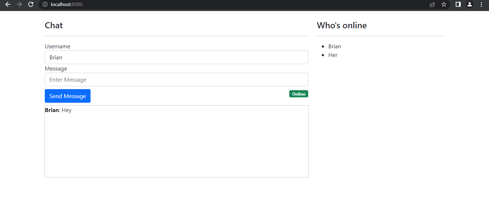
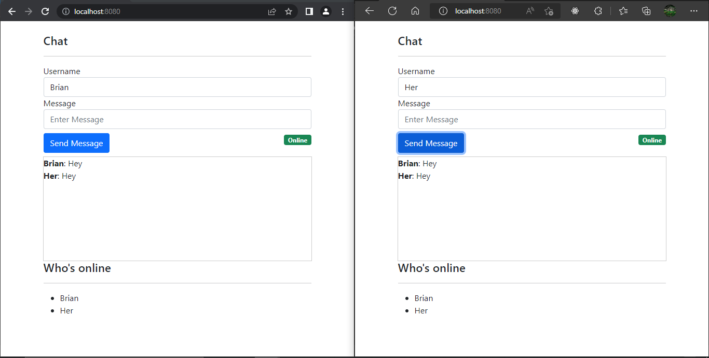

# wsstarter
This repo contains a very simple implemtation of a web based chat application written in go utilizing websocket technology

## Snips



## Utilizes 

1. <a href='https://github.com/joewalnes/reconnecting-websocket'>joewalnes/reconnecting-websocket</a> - To facilitate reconnecting to the websocket incase of server disconnection.
2. <a href='https://github.com/CloudyKit/jet'>Jet Template Engine for Go</a> 
3. <a href='https://github.com/bmizerany/pat'>bmizerany/pat</a> - A Sinatra style pattern muxer for Go's net/http library
4. <a href='https://github.com/CloudyKit/jet'>Gorilla WebSocket</a> - a Go implementation of the WebSocket protocol.


## How to run
  ````
    1. Clone the repo.
    2. Navigate to the root folder of the cloned repo.
    3. Run go run ./cmd/web/. (for windows pc) and go run /cmd/web/*(on mac) in the terminal.
    4. Pray that it works!
    5. If all is well, you should get  the following lines printed out on your terminal 
            starting channel listener
            starting web server at port 8080
  ````

## Don't know what Go/GoLang is?

Head on over to <a href='https://go.dev/'>The Go Programming Language</a>

## Questions?
 
Didn't understand something? All the code is mostly self-explanatory but still if you have any questions email me(gichukbx@gmail.com) email